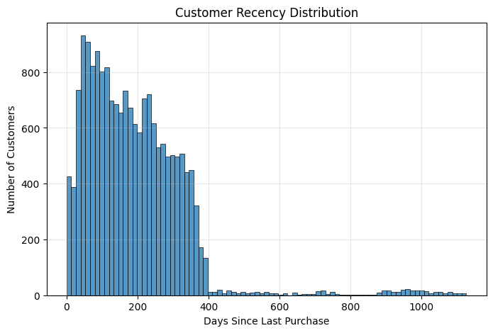

# 📊 Enterprise Retail Customer Analytics Platform

<p align="center">
  
</p>

<p align="center">


</p>

---

# 📌 Project Overview

The **Enterprise Retail Customer Analytics Platform** is an end-to-end customer analytics and business intelligence solution developed using **SQL Server, Python, Machine Learning, and Power BI**.

The project integrates:

- Enterprise Data Warehouse Development
- Exploratory Data Analysis (EDA)
- Customer Segmentation
- Customer Lifetime Value Analysis
- Customer Retention Cohort Analysis
- Customer Churn Prediction
- Sales Forecasting
- Interactive Business Intelligence Dashboards

The objective of this project is to transform raw retail transaction data into actionable business insights that support customer retention, revenue growth, and strategic decision-making.

---

# 🚀 Business Objectives

This project addresses the following business problems:

✅ Identify high-value customers

✅ Segment customers based on purchasing behavior

✅ Predict customer churn risk

✅ Forecast future sales revenue

✅ Analyze customer retention patterns

✅ Calculate customer lifetime value

✅ Develop executive business dashboards

✅ Build an enterprise-grade retail analytics ecosystem

---

# 🏗️ System Architecture

<p align="center">
  
</p>

The architecture follows a layered analytics approach:

```
Raw Data Sources
        ↓
SQL Server Data Warehouse
        ↓
Data Processing & ETL Pipelines
        ↓
Python Analytics Layer
        ↓
Machine Learning Models
        ↓
Power BI Executive Dashboard
```

---

# 🛠️ Technology Stack

| Category | Technology |
|----------|------------|
| Database | SQL Server |
| Programming | Python |
| Data Analysis | Pandas |
| Machine Learning | Scikit-Learn |
| Visualization | Power BI |
| Notebook Environment | Google Colab |
| Version Control | Git & GitHub |
| ETL | SQL ETL Pipelines |

---

# 📂 Repository Structure

```text
Enterprise-Retail-Customer-Analytics-Platform/

├── architecture/
├── dashboard/
├── datasets/
├── database/
├── scripts/
├── notebooks/
├── outputs/
├── docs/
├── requirements.txt
├── README.md
└── LICENSE
```

---

# 🗄️ Data Warehouse Architecture

The project follows a multi-layer warehouse design:

### Bronze Layer
Raw CRM and ERP datasets.

### Silver Layer
Cleaned, standardized and transformed datasets.

### Gold Layer
Business-ready analytical datasets and reporting tables.

### Star Schema

- Fact Table:
  - fact_sales

- Dimension Tables:
  - dim_customers
  - dim_products
  - dim_dates

---

# 📈 Exploratory Data Analysis

## Annual Sales Revenue

<p align="center">

</p>

---

## Top Countries by Sales Revenue

<p align="center">

</p>

---

# 👥 Customer RFM Analysis

RFM analysis was performed to understand customer purchasing behavior.

- Recency
- Frequency
- Monetary Value

## Customer Recency Distribution

<p align="center">

</p>

---

## Frequency vs Monetary Value

<p align="center">

</p>

---

## Customer Segments

<p align="center">

</p>

---

# 💰 Customer Lifetime Value Analysis

Customer Lifetime Value (CLV) was calculated to identify long-term customer profitability.

## CLV Distribution

<p align="center">

</p>

---

## Top Customers by CLV

<p align="center">

</p>

---

# 🔄 Customer Cohort Retention Analysis

Customer retention patterns were analyzed using cohort analysis.

<p align="center">

</p>

---

# 🧠 Customer Segmentation

K-Means clustering was applied to segment customers according to purchasing behavior.

<p align="center">

</p>

---

# ⚠️ Customer Churn Prediction

A machine learning model was developed to predict customer churn behavior.

<p align="center">

</p>

---

# 📈 Sales Forecasting

Future sales revenue was forecasted using historical sales patterns.

## Historical Sales Trend

<p align="center">

</p>

---

## Forecasted Sales Revenue

<p align="center">

</p>

---

# 📊 Power BI Dashboard

An executive-level Power BI dashboard was developed to provide:

- Revenue Analysis
- Customer Analysis
- Product Analysis
- Sales Trends
- Geographic Insights
- Customer Segmentation
- KPI Monitoring

<p align="center">

</p>

---

# 📋 Key Project Deliverables

✅ Enterprise Data Warehouse

✅ ETL Pipeline Development

✅ Exploratory Data Analysis

✅ Customer Analytics

✅ Customer Lifetime Value Analysis

✅ Customer Segmentation

✅ Customer Churn Prediction

✅ Sales Forecasting

✅ Cohort Retention Analysis

✅ Interactive Power BI Dashboard
