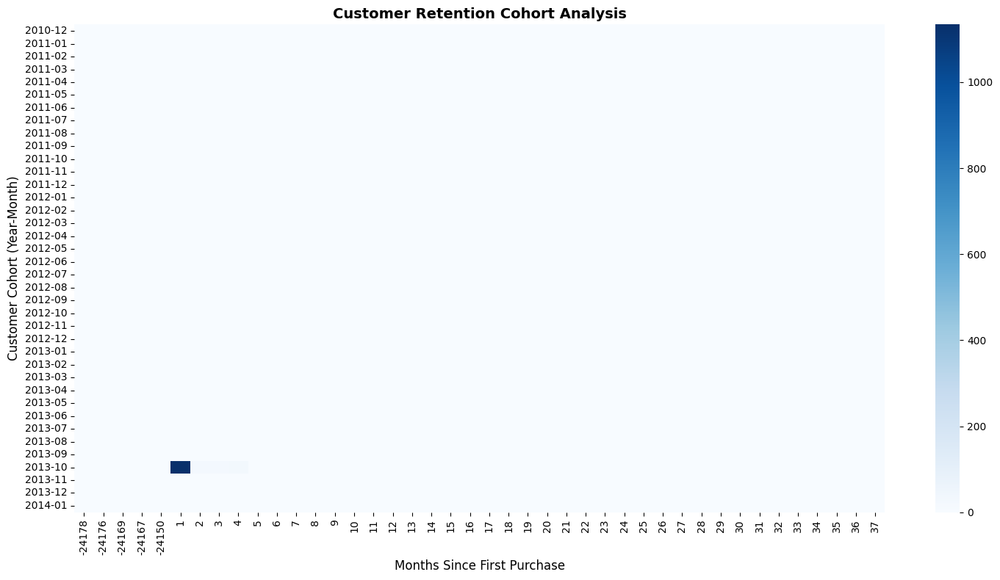

# Enterprise-Retail-Customer-Analytics-Platform

A comprehensive enterprise retail analytics solution that integrates **SQL Data Warehousing**, **Customer Analytics**, **Machine Learning**, and **Business Intelligence** to transform raw transactional data into actionable business insights.

---

## Project Overview

The **Enterprise-Retail-Customer-Analytics-Platform** demonstrates the complete analytics lifecycle, beginning with raw customer and transaction data ingestion and ending with predictive analytics and interactive business intelligence dashboards.

This project combines:

- Data Engineering
- SQL Data Warehousing
- Exploratory Data Analysis
- Customer Analytics
- Machine Learning
- Business Intelligence

---

## Architecture


---

## Technology Stack

| Category | Technologies |
|----------|-------------|
| Database | SQL Server |
| Programming | Python |
| Analytics | Pandas |
| Machine Learning | Scikit-learn |
| Development Environment | Google Colab |
| Business Intelligence | Power BI |
| Version Control | GitHub |

---

## Key Features

### Data Warehouse
- Bronze, Silver and Gold Layer Architecture
- Star Schema Design
- Fact and Dimension Modeling
- Customer and Product Reporting Tables

### Customer Analytics
- Exploratory Data Analysis
- RFM Analysis
- Customer Lifetime Value Analysis
- Cohort Retention Analysis

### Machine Learning
- Customer Segmentation
- Customer Churn Prediction
- Sales Forecasting

### Business Intelligence
- Interactive Power BI Dashboard
- Customer Insights
- Product Performance
- Revenue Analysis
- Forecasting Dashboard

---

## Project Workflow

```text
Raw Data Sources
        ↓
ETL Pipeline
        ↓
SQL Data Warehouse
        ↓
Analytics Dataset Creation
        ↓
Exploratory Data Analysis
        ↓
RFM Analysis
        ↓
Customer Lifetime Value
        ↓
Cohort Analysis
        ↓
Customer Segmentation
        ↓
Customer Churn Prediction
        ↓
Sales Forecasting
        ↓
Power BI Dashboard
```

---

## Repository Structure

```text
Enterprise-Retail-Customer-Analytics-Platform/
│
├── architecture/
├── dashboard/
├── database/
├── datasets/
├── docs/
├── notebooks/
├── outputs/
├── scripts/
├── README.md
├── LICENSE
├── .gitignore
└── requirements.txt
```

---

# Exploratory Data Analysis

### Sales by Year


### Top Countries by Revenue


---

# RFM Analysis

### Recency Distribution


### Frequency vs Monetary Analysis


---

# Customer Lifetime Value Analysis

### Top Customers by CLV


### Customer Lifetime Value Distribution


---

# Cohort Analysis

### Customer Retention Heatmap



---

# Customer Segmentation

### K-Means Customer Clustering


---

# Customer Churn Prediction

### Feature Importance Analysis


---

# Sales Forecasting

### Monthly Sales Trend


### Sales Forecast Prediction


---

# Power BI Dashboard


---

## Dataset Layers

### Bronze Layer
Raw data extracted from source systems.

### Silver Layer
Cleaned, standardized, and transformed data.

### Gold Layer
Business-ready analytical and reporting tables.

---

## Machine Learning Models

| Model | Purpose |
|--------|---------|
| K-Means Clustering | Customer Segmentation |
| Random Forest | Customer Churn Prediction |
| Time Series Forecasting | Sales Forecasting |

---

## Business Insights Generated

- Customer Segmentation Analysis
- Customer Lifetime Value Estimation
- Customer Retention Analysis
- Customer Churn Prediction
- Product Performance Analysis
- Sales Trend Analysis
- Revenue Forecasting
- Country-wise Sales Analysis

---

## How to Run

### Clone Repository

```bash
git clone https://github.com/your-username/Enterprise-Retail-Customer-Analytics-Platform.git
```

### Install Dependencies

```bash
pip install -r requirements.txt
```

### Execute SQL Scripts

```text
scripts/sql/
```

### Run Analytics Scripts

```bash
python scripts/analytics/master_dataset_creation.py
python scripts/analytics/rfm_analysis.py
python scripts/analytics/clv_analysis.py
python scripts/analytics/cohort_analysis.py
```

### Run Machine Learning Models

```bash
python scripts/machine_learning/customer_segmentation.py

python scripts/machine_learning/customer_churn.py

python scripts/machine_learning/sales_forecasting.py
```

### Open Power BI Dashboard

```text
dashboard/Customer_Analytics_Dashboard.pbix
```

---

## Technologies Used

- SQL Server
- Python
- Pandas
- Scikit-learn
- Google Colab
- Power BI
- GitHub

---

## License

This project is licensed under the MIT License.
