# 📊 Enterprise Retail Customer Analytics Platform

<p align="center">


</p>

---

# 📌 Project Overview

The **Enterprise Retail Customer Analytics Platform** is an enterprise-grade customer analytics and business intelligence solution developed using **SQL Server, Python, Machine Learning, and Power BI**.

This project integrates **Data Engineering, Data Analytics, Machine Learning, and Business Intelligence** to transform raw retail transaction data into actionable business insights for strategic decision-making.

The platform enables organizations to:

- Understand customer purchasing behavior
- Segment customers intelligently
- Predict customer churn
- Estimate customer lifetime value
- Analyze customer retention
- Forecast future sales revenue
- Visualize business KPIs through executive dashboards

---

# 🚀 Business Objectives

This project addresses several critical business challenges:

✅ Identify high-value customers

✅ Segment customers based on purchasing behavior

✅ Predict customer churn risk

✅ Forecast future sales revenue

✅ Analyze customer retention patterns

✅ Calculate customer lifetime value

✅ Develop executive business dashboards

✅ Build an enterprise-scale customer analytics ecosystem

---

# ⭐ Project Highlights

✔ Designed and implemented an Enterprise Data Warehouse using SQL Server

✔ Developed ETL pipelines using Bronze → Silver → Gold architecture

✔ Performed Exploratory Data Analysis using Python

✔ Built Customer RFM Analytics framework

✔ Developed Customer Lifetime Value (CLV) analysis

✔ Implemented Customer Cohort Retention Analysis

✔ Developed Customer Segmentation using K-Means Clustering

✔ Built Customer Churn Prediction models

✔ Created Sales Forecasting models

✔ Developed an interactive executive Power BI dashboard with KPI cards, dynamic slicers, and business intelligence visualizations

---

# 🏗️ System Architecture

<p align="center">
  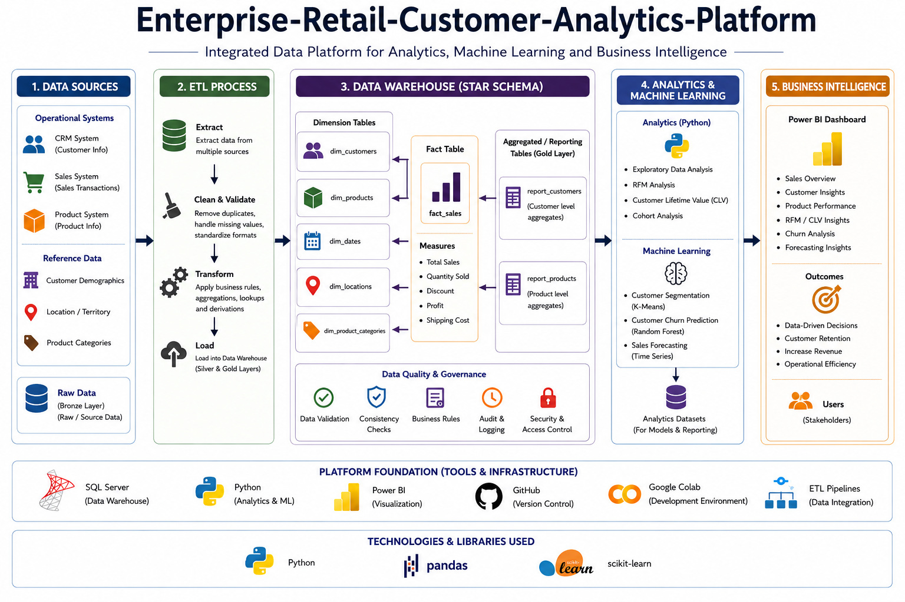
</p>

The architecture follows a layered enterprise analytics approach:

```text
Raw Data Sources
        ↓
SQL Server Data Warehouse
        ↓
Data Processing & ETL Pipelines
        ↓
Python Analytics Layer
        ↓
Machine Learning Models
        ↓
Power BI Executive Dashboard
```

---

# 🔄 Project Workflow


The project workflow follows these stages:

```text
CRM + ERP Data
       ↓
ETL Pipelines
       ↓
SQL Server Data Warehouse
(Bronze → Silver → Gold)
       ↓
Master Dataset Creation
       ↓
Exploratory Data Analysis
       ↓
Customer Analytics
(RFM, CLV, Cohort)
       ↓
Machine Learning
(Segmentation, Churn, Forecasting)
       ↓
Power BI Dashboard
       ↓
Business Insights
```

---

# 🛠️ Technology Stack

| Category | Technology |
|----------|------------|
| Database | SQL Server |
| Programming | Python |
| Data Analysis | Pandas |
| Machine Learning | Scikit-Learn |
| Visualization | Power BI |
| Notebook Environment | Google Colab |
| Version Control | Git & GitHub |
| ETL | SQL ETL Pipelines |

---

# 📂 Repository Structure

```text
Enterprise-Retail-Customer-Analytics-Platform/

├── architecture/
├── dashboard/
├── datasets/
├── database/
├── scripts/
├── notebooks/
├── outputs/
├── docs/
├── requirements.txt
├── README.md
└── LICENSE
```

---

# 📊 Project Statistics

| Metric | Value |
|---------|---------|
| Customers | 18,000+ |
| Transactions | 50,000+ |
| Countries | 6 |
| Data Warehouse Layers | 3 |
| Machine Learning Models | 3 |
| Analytical Modules | 5 |
| Dashboard Visuals | 13 |
| SQL Scripts | 14 |
| Power BI Dashboards | 1 |

---

# 📈 Business KPIs Generated

- Total Revenue
- Total Quantity Sold
- Total Orders
- Total Customers
- Average Order Value
- Revenue Per Customer
- Revenue by Product Category
- Top 10 Products by Revenue
- Top Countries by Revenue
- Annual Revenue Trend
- Monthly Revenue Trend
- Customer Age Distribution
- Customer Segment Distribution

---

# 🗄️ Data Warehouse Architecture

The project follows a multi-layer enterprise warehouse design.

### Bronze Layer
Raw CRM and ERP datasets.

### Silver Layer
Cleaned, validated, standardized and transformed datasets.

### Gold Layer
Business-ready analytical datasets and reporting tables.

---

## Star Schema Design

### Fact Table

- fact_sales

### Dimension Tables

- dim_customers
- dim_products
- dim_dates

---

# 📈 Exploratory Data Analysis

Exploratory analysis was performed to identify trends, customer behavior patterns, and revenue insights.

## Annual Sales Revenue

<p align="center">
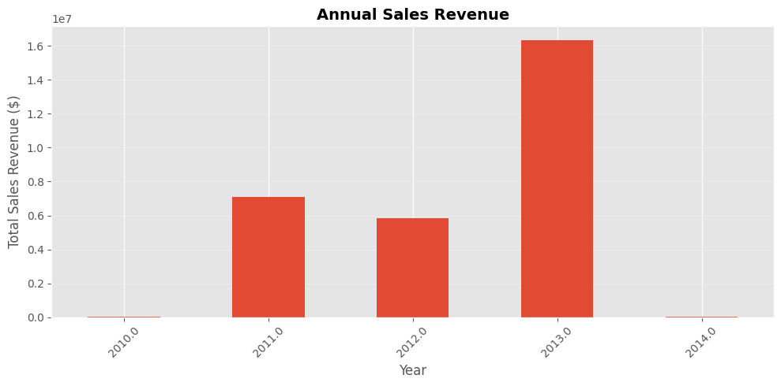
</p>

---

## Top Countries by Sales Revenue

<p align="center">
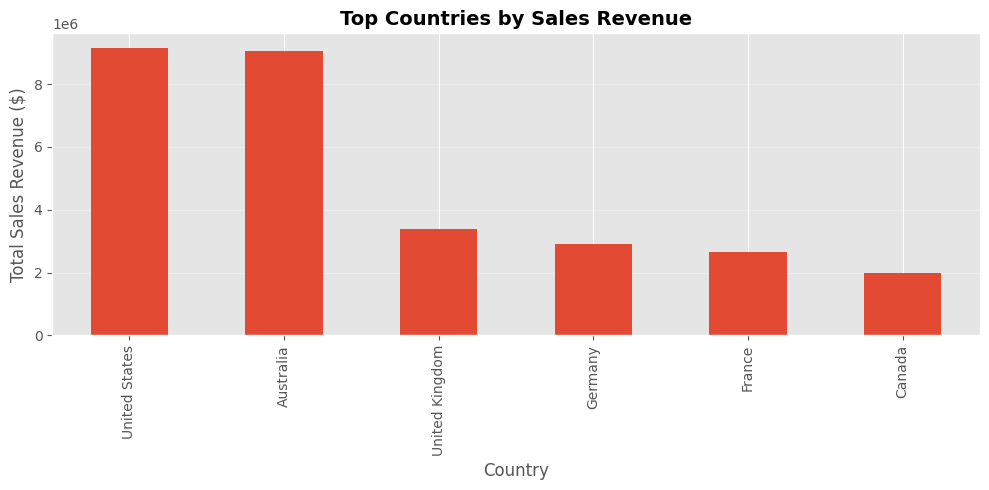
</p>

---

# 👥 Customer RFM Analysis

RFM analysis was performed to understand customer purchasing behavior using:

- Recency
- Frequency
- Monetary Value

## Customer Recency Distribution

<p align="center">

</p>

---

## Frequency vs Monetary Value

<p align="center">
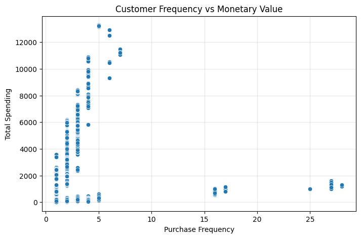
</p>


---

# 💰 Customer Lifetime Value Analysis

Customer Lifetime Value (CLV) analysis was conducted to identify long-term customer profitability.

## CLV Distribution

<p align="center">
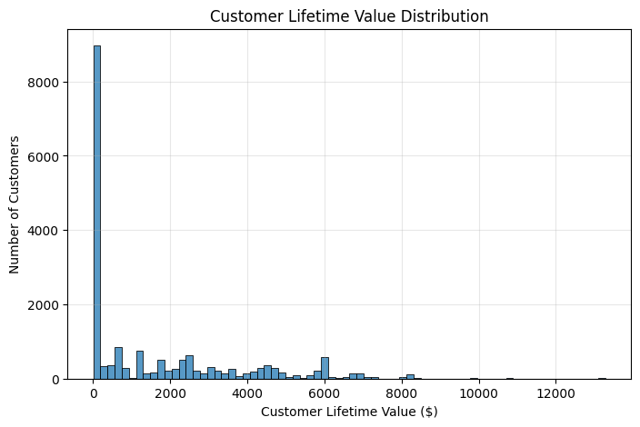
</p>

---

## Top Customers by CLV

<p align="center">
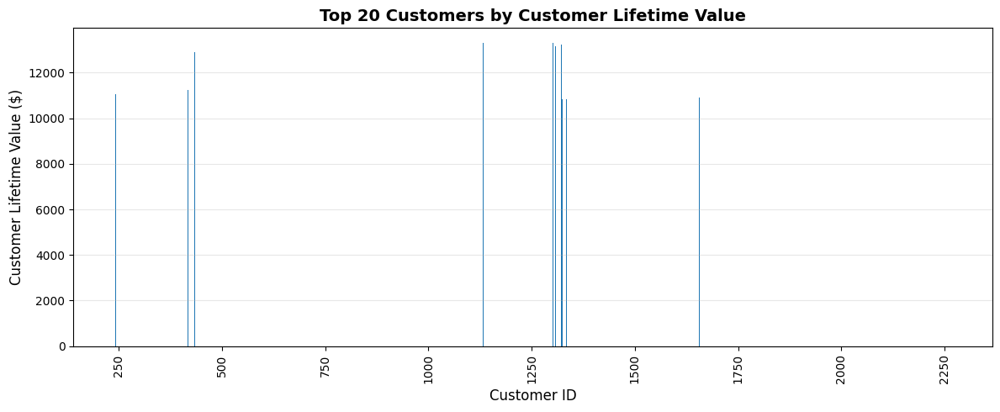
</p>

---

# 🧠 Customer Segmentation

K-Means clustering was applied to segment customers according to purchasing behavior.

<p align="center">
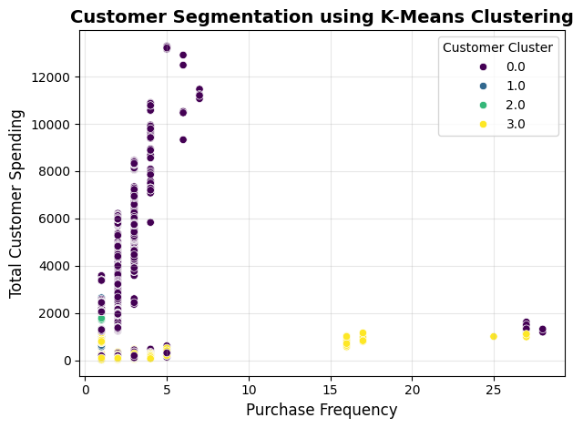
</p>

---

# ⚠️ Customer Churn Prediction

A machine learning model was developed to predict customer churn behavior.

<p align="center">
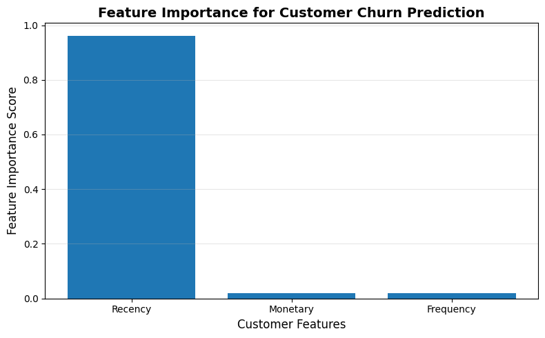
</p>

---

# 📈 Sales Forecasting

Historical sales data was analyzed to forecast future revenue trends.

## Monthly Sales Revenue Trend

<p align="center">
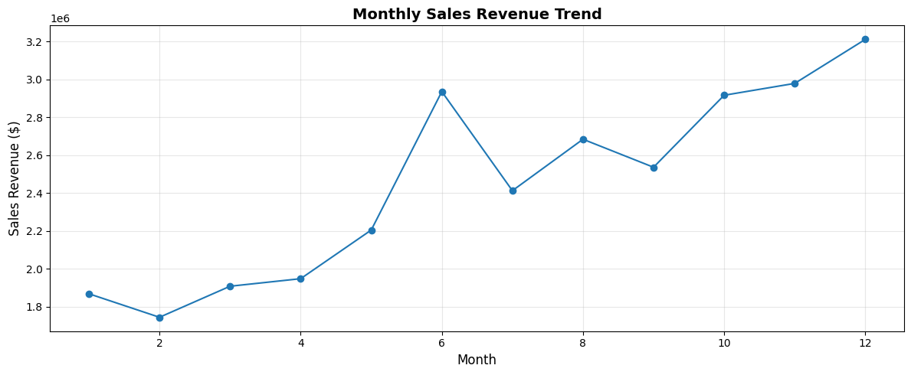
</p>

---

## Historical vs Forecasted Sales Revenue

<p align="center">
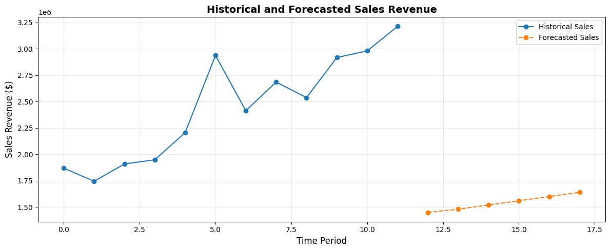
</p>

---

# 💡 Key Business Insights

- The United States and Australia generated the highest overall revenue.
- Bikes contributed the majority of total product revenue.
- A small group of products accounted for the highest sales revenue.
- Monthly revenue showed an overall upward trend throughout the year.
- Annual revenue peaked in 2013 before declining in 2014.
- Most customers belong to the "New" customer segment.
- Customers aged 50 and above represent the largest customer group.

---

# 📊 Power BI Dashboard

An executive-level Power BI dashboard was developed to provide interactive business insights through:

- Executive KPI Cards
- Revenue Analysis
- Product Performance Analysis
- Country-wise Revenue Analysis
- Annual & Monthly Revenue Trends
- Customer Age Distribution
- Customer Segment Distribution
- Interactive Filters (Country, Year & Customer Segment)
- Executive KPI Monitoring

<p align="center">
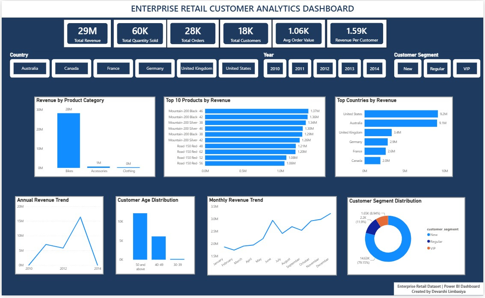
</p>

The dashboard provides an executive overview of retail business performance through interactive KPI cards, dynamic slicers, revenue trends, product analysis, customer demographics, and geographical insights, enabling users to explore business performance across different countries, years, and customer segments.

### Dashboard Features

- Executive KPI Cards
- Interactive Country Filter
- Interactive Year Filter
- Customer Segment Filter
- Revenue by Product Category
- Top 10 Products by Revenue
- Top Countries by Revenue
- Annual Revenue Trend
- Monthly Revenue Trend
- Customer Age Distribution
- Customer Segment Distribution
---

# 📋 Key Project Deliverables

✅ Enterprise Data Warehouse Development

✅ ETL Pipeline Development

✅ Exploratory Data Analysis

✅ Customer RFM Analysis

✅ Customer Lifetime Value Analysis

✅ Customer Cohort Retention Analysis

✅ Customer Segmentation using K-Means

✅ Customer Churn Prediction

✅ Sales Forecasting

✅ Executive Power BI Dashboard

✅ Enterprise Customer Analytics Platform
